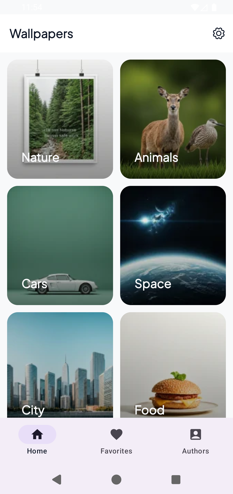
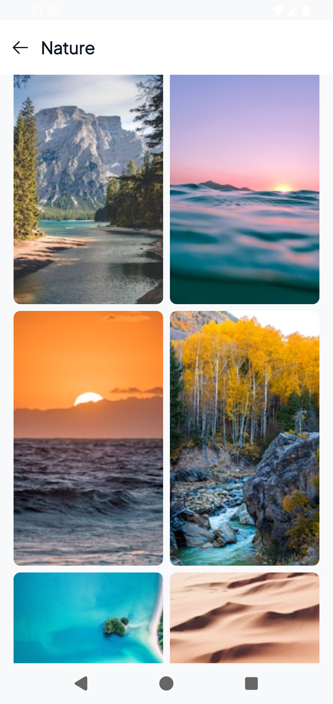
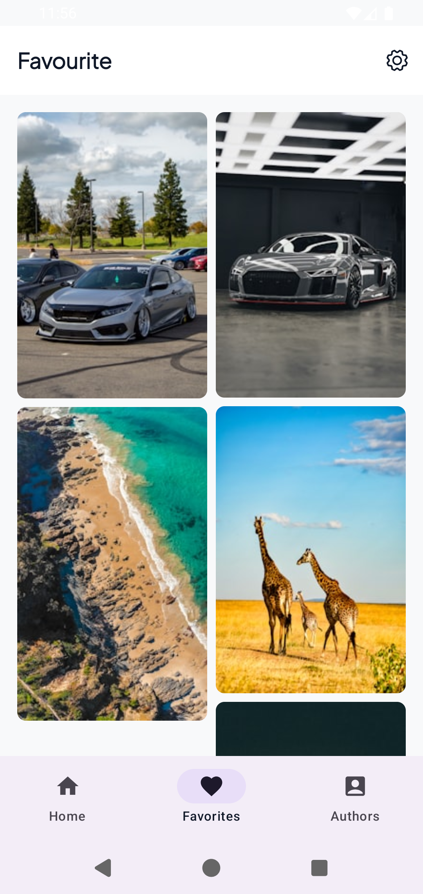
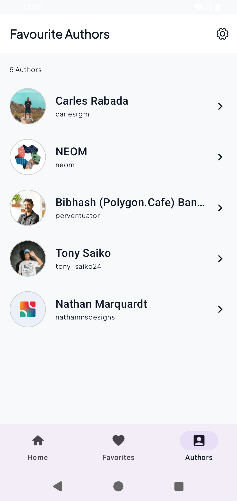
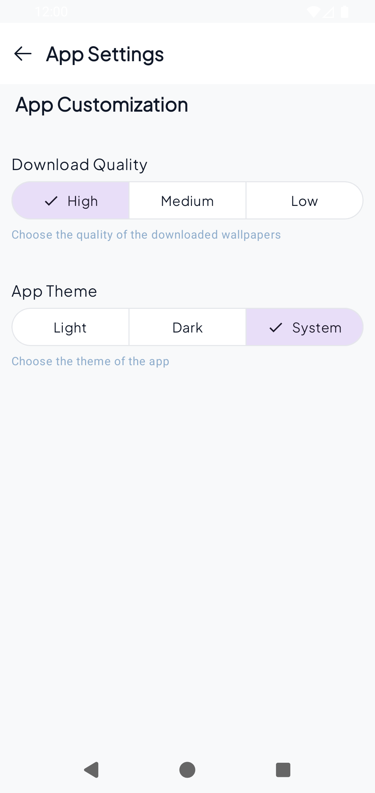
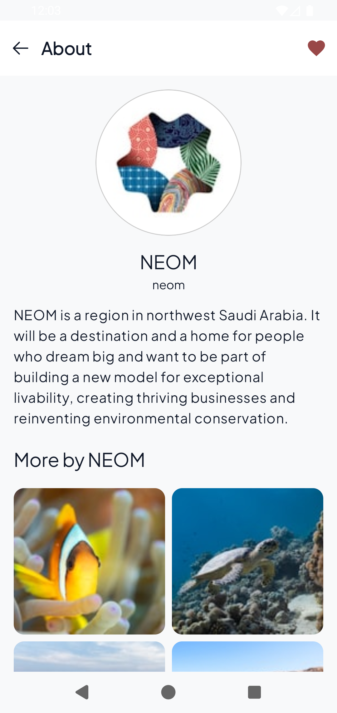

# Banger

A modern, modular Android wallpaper app built with **Jetpack Compose**, **Kotlin**, and **Clean-ish feature modularization**. It lets users browse wallpaper categories, view wallpaper details, explore authors, save favourites, and customize app theme preferences.

## Table of Contents
- [Overview](#overview)
- [Key Features](#key-features)
- [Tech Stack](#tech-stack)
- [Project Architecture](#project-architecture)
  - [High-Level Module Map](#high-level-module-map)
  - [Layer Responsibilities](#layer-responsibilities)
  - [Dependency Injection Graph](#dependency-injection-graph)
  - [Navigation Architecture](#navigation-architecture)
  - [Data Flow](#data-flow)
- [Modules](#modules)
- [Screenshots](#screenshots)
- [Getting Started](#getting-started)
  - [Prerequisites](#prerequisites)
  - [Setup](#setup)
  - [Build and Run](#build-and-run)
- [Quality and Tooling](#quality-and-tooling)
- [Notes](#notes)

---

## Overview

**Banger** is a multi-module Android app that integrates with the **Unsplash API** to serve wallpaper content. The app uses:

- A **feature-first module structure** (`feature/*`) for UI + use cases per screen area.
- `data:remote` for network concerns (Retrofit, OkHttp, serialization).
- `data:local` for Room persistence and DataStore-backed settings.
- Koin for dependency injection and Compose Navigation for routing.

---

## Key Features

- Browse curated wallpaper categories from Home.
- Open category-specific wallpaper feeds.
- View wallpaper details and related metadata.
- Browse authors and inspect author profile/details.
- Save and view favourite wallpapers.
- Configure app theme (system / light / dark).

---

## Tech Stack

- **Language**: Kotlin
- **UI**: Jetpack Compose + Material 3
- **Navigation**: Navigation Compose (typed routes with Kotlin serialization)
- **DI**: Koin
- **Networking**: Retrofit + OkHttp + kotlinx.serialization
- **Image Loading**: Coil 3
- **Local Storage**:
  - Room (cached photos, metadata, favourites)
  - DataStore Preferences (theme settings)
- **Build**: Gradle (Kotlin/Android plugin aliases via Version Catalog)
- **Static Checks**: ktlint configured at root and aggregated across modules

---

## Project Architecture

### High-Level Module Map

```text
app (entrypoint, nav host, app scaffolding)
├── feature:home
├── feature:details
├── feature:favourites
├── feature:author
├── feature:author_details
├── feature:settings
├── shared:theme
├── shared:utility
├── data:remote
└── data:local
```

### Layer Responsibilities

This project is organized by feature, where each feature commonly contains:

- `ui/` → Compose screens + ViewModels
- `domain/` → repository contracts/implementations + use-case logic
- `di/` → Koin module bindings for that feature

Supporting shared/data modules:

- `data:remote` → Retrofit setup, OkHttp interceptors, API constants/models.
- `data:local` → Room database, DAO, entities, and DataStore-based settings repo.
- `shared:theme` → app theme, reusable UI components, resources.
- `shared:utility` → utility helpers like blur hash decoding.

### Dependency Injection Graph

The app initializes Koin in `WallpaperDownloaderApplication` and registers modules from app/data/features.

Core idea:

1. `remoteModule` provides `Retrofit`, `OkHttpClient`, JSON parser.
2. `localModule` provides `WDDatabase`, `WDDao`, `SettingsRepository`.
3. Each feature module requests only what it needs (e.g., `Retrofit`, `WDDao`, dispatchers) and exposes `ViewModel` + repository bindings.

This keeps feature concerns isolated and testable.

### Navigation Architecture

`MainActivity` hosts a single `NavHost` with typed destinations (`AppDestinations`) and a bottom bar for:

- Home
- Favourites
- Authors

Additional routes:

- Category Details
- Wallpaper Details
- Settings
- Author Details

Navigation uses serialized route data classes, allowing strongly typed arguments like `Details(id)` and `AuthorDetails(username)`.

### Data Flow

A typical flow (example: category photos):

1. UI triggers ViewModel action.
2. ViewModel calls repository/use-case.
3. Repository fetches remote data via Retrofit.
4. Repository caches/reads entities via Room DAO.
5. UI collects Flow/State and recomposes.

Theme flow:

1. `MainViewModel` collects theme from `SettingsRepository` (DataStore).
2. App theme updates in `MainActivity` and recomposes globally.

---

## Modules

### `app`
- Application class starts Koin and wires all modules.
- `MainActivity` owns app-wide scaffold + bottom navigation + route graph.
- `MainViewModel` exposes app theme state from local settings.

### `feature:home`
- Category landing screen and category wallpaper listing.
- Home repository handles both network retrieval and category-based local cache stream.
- Includes `HomeUseCase` for concurrently requesting multiple sections.

### `feature:details`
- Wallpaper detail screen.
- Fetches expanded item details and supports detail actions.

### `feature:favourites`
- Favourite wallpapers list and interactions.
- Backed by local storage layer for persisted favourite state.

### `feature:author`
- Author listing and navigation to author details.

### `feature:author_details`
- Author profile/details screen and related author images.

### `feature:settings`
- Settings UI, including theme preference management.

### `data:remote`
- Retrofit base URL: `https://api.unsplash.com/`
- Adds Unsplash `client_id` via OkHttp interceptor using `BuildConfig.ACCESS_KEY`.
- Configures JSON parser and logging interceptor.

### `data:local`
- Room database (`WDDatabase`) with migration history.
- Entities for photos, users, urls, links, profile images.
- DataStore settings repository for app theme preference.

### `shared:theme`
- Compose theme and reusable UI components.
- Centralized colors, typography, shapes, and drawable resources.

### `shared:utility`
- Utility helpers (e.g., blur hash decoder).

---

## Screenshots

Below are project screenshots pulled from the `screenshots/` folder in the repository root.

### App Preview Gallery








---

## Getting Started

### Prerequisites

- Android Studio (recent stable)
- Android SDK (compile/target SDK 35)
- JDK 11
- Unsplash access key

### Setup

1. Clone the repository.
2. Create a `local.properties` file in project root if missing.
3. Add your Unsplash key:

```properties
ACCESS_KEY=your_unsplash_access_key_here
```

> The key is injected through Gradle into `BuildConfig.ACCESS_KEY` for modules that apply the shared build logic.

### Build and Run

Use Android Studio Run, or CLI:

```bash
./gradlew :app:assembleDebug
./gradlew :app:installDebug
```

Optional quality checks:

```bash
./gradlew ktlintCheck
./gradlew test
```

---

## Quality and Tooling

- **ktlint** is applied across subprojects and aggregated into root tasks.
- Multi-module structure improves build isolation and ownership.
- Room schema is exported under `data/local/schemas/` for migration visibility.

---

## Notes

- Project name in Gradle: **Banger**.
- Minimum SDK is **24**.
- The repository currently stores screenshots in `screenshots/` and this README links directly to those assets.

